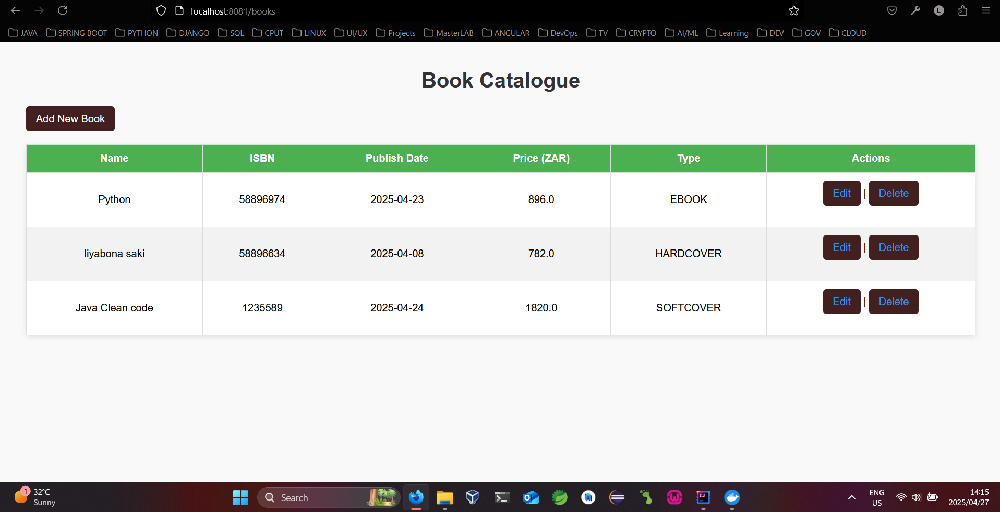

# 📚 CatalogueWebUI

CatalogueWebUI is a simple Spring Boot + Thymeleaf web application that allows users to **view**, **add**, **edit**, and **delete** books from a catalogue.

It interacts with a backend REST API to manage book records.

---

## ✨ Features
- View a list of all books
- Add new books
- Edit existing books
- Delete books
- Responsive and simple UI using Thymeleaf

---

## 🛠️ Tech Stack
- Java 17
- Spring Boot 3
- Thymeleaf
- Maven
- Docker

---

## 🚀 Running Locally

### Prerequisites
- Java 17
- Maven
- SpringBoot 3
- Docker (optional for containerized deployment)

## ⚙️ How to Run

### 🐳 Docker (Recommended)

1. **Ensure you have created the docker network in the Catalogue management service**
   ```bash
   docker network create catalogue-network

2. **Build the Docker image:**
   ```bash
   docker build -t catalogue-webui .

3. **Run the Docker image inside the network and let it connect to the Management service:**
   ```bash
   docker run -d --name cataloguewebui --network catalogue-network -p 8081:8081 -e catalogue.management.url=http://cataloguemanagement:8080/api/books catalogue-webui

### 🧪 Running Locally (without Docker)

1. **Build the project to produce the jar :**
   ```bash
      mvn clean package

2. **Run the application:**
   ```bash
      java -jar target/CatalogueWebUI-0.0.1-SNAPSHOT.jar

### Running with Maven

1. **Clone the repository :**
    ```bash
   git clone https://github.com/liyabonasaki/CatalogueWebUI.git
   cd CatalogueWebUI

2. **Build and run the project:**
   ```bash
   mvn spring-boot:run

## Access the application:
Open your browser and go to http://localhost:8081/books
